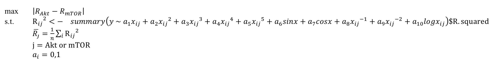
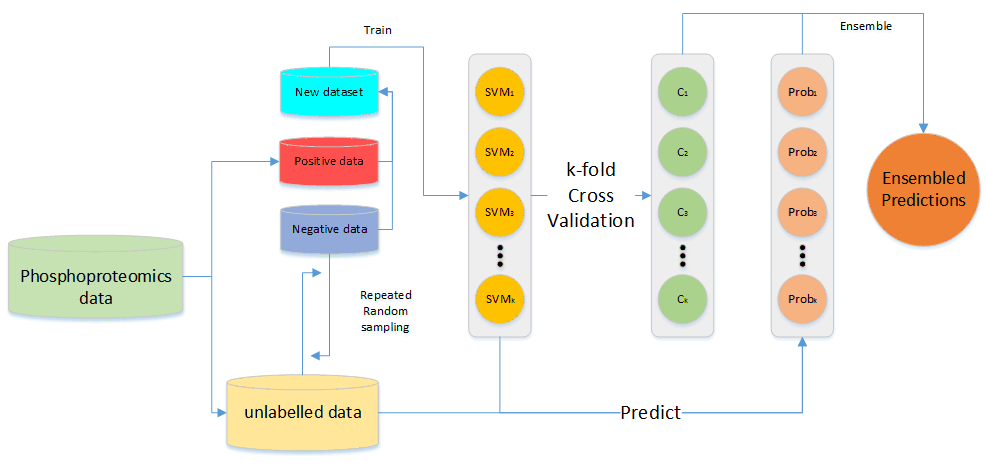

<div style="text-align:center">
<font size="5", style="font-weight:bold">
STAT5003 Assignment 2 Report
</font>

<font size="2">
Dongdong Zhang(470161133) ; Ruoyu Zhuang (470132373); Shaowei Zhang (470144491); Ye Yuan (460442862)
</font>
</div>
#### 1. Problem description

Protein phosphorylation is a post-translational modification that underlines various aspects of cellular signaling. A key step to reconstructing signaling networks involves identification of the set of all kinases and their substrates. However, experimental characterization of kinase substrates is both expensive and time-consuming[1-2]. This project aims to classify the substrates efficiently even only few of them are labelled and most of them are unlabelled.

The "InsulinPhospho.txt" dataset has 12603 samples. Only 22 of them are labelled as Akt substrates and 26 of them are labelled as mTOR substrates. This project needs to predict the probability of each sample to be a Akt substrate and to be a mTOR substrate.

The original features are a time series data and few experimental data like "LY" or "MK". Features named "AUC" and "Avgfold" is provided by the lecturer already. This project needs to use or extract meaningful features to improve the performance of the classification. Besides, the predictions of this project should be envaluated in a convincing way.


```{r library, warning=FALSE}
# load the libraries
library(reshape2)
library(ggplot2)

library(caret)
library(e1071)

library(openxlsx)

library(dplyr)
library(tidyr)

```

```{r load data}
# load all data
InsulinPhospho <- read.delim("InsulinPhospho.txt", header =TRUE)
# load Akt label
Akt.substrates <- read.delim("Akt_substrates.txt", header =FALSE)
# load mTOR label
mTOR.substrates <- read.delim("mTOR_substrates.txt", header =FALSE)
```

#### 2. Feature extraction
2.1 Fitted Score (R Squre Score)

R Squre Score is a goodness-of-fit measurement for linear regression models. This statistic indicates the percentage of the variance in the dependent variables that the independent variables explain collectively. R-squared measures the strength of the relationship between the model and the dependent variable on a convenient 0 - 100% scale.

$$R^2=\frac{\sum_{i}(\hat{y}_i-\bar{y})}{\sum_{i}(y_i-\bar{y})}=\frac{SS_{regression}}{SS_{total}}$$

After fitting a linear regression model, R Squre Score can measure this model whether it is suitable for this data set.

2.1.1 plot time line

Firstly, based on the timeline of insulin stimulated phosphorylation profiles in log2, we want to know whether Akt's timeline is different from mTOR's timeline. Therefore, we plot the timeline of labeled Akt and mTOR.

Before plotting, we want to eliminate the effect of some insulin's gross influences, so the insulin stimulated phosphorylation profiles data is standardized by Identifier (row data).

The standardization is as below:

$$Standardized_{ij}=\frac{Insulin_{ij}-\overline{Insulin}}{\sigma}$$

The mean of each time stimulated data from each insulin's stimulated phosphorylation is subtracted. Then it is divided by its standard deviation.

After standardization, labeled timeline data by ggplot2 are plotted respectively.

```{r}
InsulinPhospho.time = InsulinPhospho[,c(1,5:12)]

# vlookup
Akt.substrates.vlooked = merge(Akt.substrates, InsulinPhospho.time, by.x = "V1", by.y = "Identifier")
mTOR.substrates.vlooked = merge(mTOR.substrates, InsulinPhospho.time, by.x = "V1", by.y = "Identifier")


normalize.f <- function(datamat){
  datamat.normalized = data.frame(data = NA, nrow = nrow(datamat), ncol = ncol(datamat))
  
  # get mean and std by row (remove ---name col-----)
  datamat.rowmean = rowMeans(datamat[, -1])
  datamat.rowstd = apply(datamat[, -1], 1, sd)
  for(i in 1:nrow(datamat)){
    for(j in 1:ncol(datamat)){
      
      # add col name for normalized data
      if(j == 1){
        toString(datamat.normalized[i, j])
        datamat.normalized[i,j] <- toString(datamat[i, j])
      }else{
        datamat.normalized[i, j] = (datamat[i, j] - datamat.rowmean[i]) / datamat.rowstd[i]
      }
    }
  }
  return(datamat.normalized)
}

mTOR.vlooked.normalized = normalize.f(mTOR.substrates.vlooked)
colnames(mTOR.vlooked.normalized) <- colnames(InsulinPhospho.time)

akt.vlooked.normalized = normalize.f(Akt.substrates.vlooked)
colnames(akt.vlooked.normalized) <- colnames(InsulinPhospho.time)


# change col name
akt.normalized.forreshape = akt.vlooked.normalized
mTOR.normalized.forreshape = mTOR.vlooked.normalized


# reshape data
akt.normalized.reshape = melt(akt.normalized.forreshape, id = "Identifier")
mTOR.normalized.reshape = melt(mTOR.normalized.forreshape, id = "Identifier")

# change Head Name
colnames(akt.normalized.reshape) = c("Identifier", "Var", "Value")
colnames(mTOR.normalized.reshape) = c("Identifier", "Var", "Value")


# plot
ggplot(data = akt.normalized.reshape, aes(x = Var, y = Value, group = Identifier, colour = Identifier)) + geom_line() + geom_point(shape=22, size = 1, fill = "white") + xlab("Time") + ylab("Change")
ggplot(data = mTOR.normalized.reshape, aes(x = Var, y = Value, group = Identifier, colour = Identifier)) + geom_line() + geom_point(shape=22, size = 1, fill = "white") + xlab("Time") + ylab("Change")
```

These are labeled Akt timeline stimulated data and labelled mTOR timeline stimulated data.

According to the figures, Akt and mTOR have a distinct difference of time trend. So we need to select a variable set that it can get a distinct r-squared value after linear regression. The reason is that if the varialbe set is fixed, the r-squared value can evluate the certain variables whether it is suitable for these data. Higher R-squared values represent smaller differences between the observed data and the fitted values when variable set is fixed. So after the linear regression for two labeled datasets with same variables have done, if one r-squared of linear regression is higher (>0.7), but the other one is lower (<0.3), the varialbes could fit with the higher data set.

To conclude, with labeled data, we calculate each r-squared value of linear regression. Dynamic programming is used to select the best variables group in the linear regression for distinguishing. The dynamic programming selects the most different model with the mean of Akt and mTor r-squared value. The formula is as below:

<div style="width:880px; height=300px">

</div>

```{r}
# test different combination model to distinguish akt and mTOR
x <- 1:8
x2 <- x^2
x3 <- x^3
x4 <- x^4
x5 <- x^5
xnn1 <- x^(-1)
sinx <-sin(x)
cosx <- cos(x)
logx <- log2(x)

x.test = rbind(x, x2, x3, x4, x5, xnn1, sinx, cosx, logx)

y.akt.mean <- colMeans(akt.vlooked.normalized[, -1])
y.mTOR.mean <- colMeans(mTOR.vlooked.normalized[, -1])

y.akt.total <- akt.vlooked.normalized[, -1]
y.mTOR.total <- mTOR.vlooked.normalized[, -1]


# dynamic programming linear regression model before mean all data
linmod.rf.coyx <- function(x.im, y.list){
  r2.total = c()
  for(i in 1:nrow(y.list)){
    combmi = data.frame(t(rbind(as.matrix(y.list[i, ]), x.im)))
    colnames(combmi)[1] <- "y"
    lm.mod <- lm(combmi[, 1] ~ as.matrix(combmi[, -1]), data = combmi)
    r2.total = c(r2.total, summary(lm.mod)$r.squared)
  }
  r2.mean = mean(r2.total)
  
  return(list(r2.mean, summary(lm.mod)$fstatistic[[1]], colnames(combmi)))
}


opt.xvar <- function(x, y1, y2){
  for(i in 2:(((length(y1) + length(y2)) / 2) - 2)){
    if(i == 2){
      rate.comp = 0
    }
    x.combi = combn(nrow(x), i)
    rate.compare.j = 0
    for(j in 1:ncol(x.combi)){
      f.statm.j = c()
      x.im = x.test[x.combi[, j], ]
      
      result.y1 <- linmod.rf.coyx(x.im, y1)
      r2.y1 = result.y1[[1]]
      f.stat.y1 = result.y1[[2]]
      col.names.j.y1 = result.y1[[3]]
      
      result.y2 <- linmod.rf.coyx(x.im, y2)
      r2.y2 = result.y2[[1]]
      f.stat.y2 = result.y2[[2]]
      col.names.j.y2 = result.y2[[3]]
      
      # calculate rate between y2 and y1 of fstat
      if(r2.y2 > r2.y1){
        rate.r = r2.y2 / r2.y1
      }else{
        rate.r = r2.y1 / r2.y2
      }
      
      # compare r output colname (remove ---y name---)
      if(rate.r > rate.compare.j){
        rate.compare.j = rate.r
        col.names.com.j <- col.names.j.y1[-1]

      }
      
    }
    if(rate.compare.j > rate.comp){
      rate.comp = rate.compare.j

      col.names.x <- col.names.com.j

    }

  }
  return(col.names.x)
}

opt.colname = opt.xvar(x.test, y.akt.total, y.mTOR.total)


opt.col.model = c()
for(i in 1:length(opt.colname)){
  opt.col.model = rbind(opt.col.model, eval(parse(text = opt.colname[i])))
}
opt.col.model = t(opt.col.model)
colnames(opt.col.model) <- opt.colname

model.akt = lm(y.akt.mean ~ opt.col.model)
model.mTOR = lm(y.mTOR.mean ~ opt.col.model)

summary(model.akt)
summary(model.mTOR)
```

Through dynamic programming, the (y ~ x^5 + cosx +1) is the best variable group for classification, because the Akt labelled data only has 0.19 R^2, which means the variables could not fit Akt. However, mTOR labelled data has 0.789 R^2 value which means the variables could fit mTOR.

Therefore, we create a feature using (y ~ x^5 + cosx +1) variables group to get r-squared value in linear regression.

```{r}
model.unlabel.score = c()
for(i in 1:nrow(InsulinPhospho.time)){

  y.unladbel = as.numeric(InsulinPhospho.time[i, 2:9])
  model.unlabel = lm(formula = y.unladbel ~ x + x2 +1)
  model.unlabel.score = c(model.unlabel.score, summary(model.unlabel)$r.squared)

}


fitted_score <- scale(data.frame(model.unlabel.score))

```

2.2 AUC

AUC is a specific characteristic which is extracted from the timeline data. It means the area under the curve of a phosphorylation sites compared to time point 0. It is scaled to [0,1]. In feature integration, the feature is created to summarise the timeline features and is given from the original datasets. We want to find whether the feature shows the significant difference and effect in different type of substrates sites and supports the feature of timeline insulin stimulated phosphorylation profiles.

The datasets provide us with the 22 known Akt substrates and 26 mTOR subsrates. We find their relative AUC by querying and extracting from the main phosphoproteomics dataset. Tthe two new data frame named akt.datamat.vlooked and mTOR.datamat.vlooked is created and combined. They contain the identifiers of labelled substrates and their AUC and the types of Akt or mTOR substrates. 

```{r}
data.mat <- InsulinPhospho
akt.datamat <- Akt.substrates
mTOR.datamat <- mTOR.substrates
data.mat.time <- data.mat[,c(1,4)]

# vlookup
akt.datamat.vlooked <- merge(akt.datamat, data.mat.time, by.x = "V1", by.y = "Identifier")
mTOR.datamat.vlooked <- merge(mTOR.datamat, data.mat.time, by.x = "V1", by.y = "Identifier")

akt.datamat.vlooked$type <- 'Akt'
mTOR.datamat.vlooked$type <- 'mTOR'
substrates <- rbind(akt.datamat.vlooked,mTOR.datamat.vlooked)
```

Loading the package 'ggplots' for the visualization. We use smoothed density estimates to demonstrate the AUC in each type of Akt or mTOR substrates. Function geom_density() is used here.

```{r}
ggplot(substrates, aes(AUC, fill = type, colour = type)) +
  geom_density(alpha = 0.5) +
  xlim(0, 1) +
  labs(title = "Figure 1: Known Akt&mTOR substrates", 
       x = "AUC (area under the curve)", 
       y = "Density") +
  theme_classic()
```

The density plot shows the bimodal pattern. The AUC of mTOR is larger than the AUC of Akt generally, even though some of them are equal. 

More evidences is needed to explore the actual influence of this feature. Hence, we deal with the prediction in previous report(Predciton_2016.xlsx). the file gives us the full model predict, which gives us the percentage values of prediction for novel substrates in Akt and mTOR. We sample the subset of data where the predictions are greater than 90% for each type of substrates and find out their AUC and their type of substrates Akt or mTOR. 

```{r}
data.mat <- InsulinPhospho
Akt.datmat <- read.xlsx("Prediction_2016.xlsx", sheet = 1)
mTOR.datmat <- read.xlsx("Prediction_2016.xlsx", sheet = 2)
subset.akt.datmat <- Akt.datmat[Akt.datmat$Full.model.predict > 0.9,]
subset.mTOR.datmat <- mTOR.datmat[mTOR.datmat$Full.model.predict > 0.9,]
subset.akt.datmat$Identifier <- paste(toupper(subset.akt.datmat$GeneSymbol), ';',
                                      subset.akt.datmat$Phosphorylation.site, ';',sep="")
subset.mTOR.datmat$Identifier <- paste(toupper(subset.mTOR.datmat$GeneSymbol), ';',
                                      subset.mTOR.datmat$Phosphorylation.site, ';',sep="")
data.mat.time <- data.mat[,c(1,4)]

# vlookup
akt.datamat.vlooked = merge(subset.akt.datmat, data.mat.time, by.x = "Identifier", by.y = "Identifier")
mTOR.datamat.vlooked = merge(subset.mTOR.datmat, data.mat.time, by.x = "Identifier", by.y = "Identifier")

akt.datamat.vlooked$type <- 'Akt'
mTOR.datamat.vlooked$type <- 'mTOR'
substrates <- rbind(akt.datamat.vlooked,mTOR.datamat.vlooked)
```

Loading the package 'ggplots' for the visualization. We use smoothed density estimates to demonstrate the AUC in each type of substrates Akt or mTOR. Function geom_density() is used here.

```{r}
ggplot(substrates, aes(AUC, fill = type, colour = type)) +
  geom_density(alpha = 0.5) +
  xlim(0, 1) +
  labs(title = "Figure 2: Above 90% of full model prediction Akt&mTOR substrates", 
       x = "AUC (area under the curve)", 
       y = "Density") +
  theme_classic()
```

The density plot shows the bimodal pattern. We see the AUC of mTOR is larger than the AUC of Akt generally, even though some of them are equal. 

From the results of the AUC density plots with two datasets, we can briefly see that the mTOR substrates of activated insulin stimulation have faster rate of change than the Akt substrates. It can support that the feature AUC is a valuable reasonable factor in our future prediction. Therefore, we keep it in our feature selection.


2.3 Motif

The main phosphoproteomics dataset gives us a specific characteristic of each phosphorylation site which is the 'Seq Window'.It is a 13-amino acid sequence of phosphorylation site in which the 7th positon corresponds to the amino acid that is phosphorylated. Each letter represents a kind of acid inside the protein. We search the supporting reference and we find a method PSSM to make the feature become reasonable. It is called 'Bioinformatics Position-Specific Scoring Matrices'[3]. In the sequence, by constructing the frequency of each symbol in each position, we calculate a corresponding value for each sequence that make the sequence digitalized. The value process the significant meaning in our feature creation. How to define the value is a complicated problem. We do some research in reference to make it come true. We do explain the procedure step by step in details later. 

A function 'findseqwidow' is conducted. We are given a list of identifiers of known substrates. For each phosphorylation site in the array, if the substrate exists and does have the corresponding sequence 'Seq Window', then output the array which contains each individual symbol in 'Seq Windows' as a string. The array should have 13 elements and each element is a single string of letter.

We deal with each letter of known Akt substrates to count the letter's frequency of occurrence in each position of 13-amino acid sequence. An example will be used to explain that. We start with the first substrate in known Akt substrates. If the first letter in lowercase in sequence of the first substrate is 'a', we add one to the value in the first row and first column inside the matrix PSSM.Akt[1,1] and then keep treating the next letter in sequence of the first substrate. If the second letter is 'k', we add one to the value in the 12th row and second column inside the matrix PSSM.Akt[12,2] and then keep treating the next letter. After processing the last letter of the first substrate, we start to continue the next substrate. Finally, we acquire a new matrix to show the number of times for each letter in each position of the sequence. Dividing the total number of known Akt substrates which is 22, we get the frequency. In addition, we find the explanation of the 7th position of sequence of the phosphorylation corresponds to the amino acid that is phosphorylated in the supplemental document of the research. The proportion of Serine which is 'S' and Threonine which is 'T' amino acids phosphorylated in phosphopeptides with high site-localization confidence which the research support and treat all phosphopeptides are either Serine or Threonine[4]. We observe that the 7th letter of each phosphyorylation sites is either 'S' or 'T'. Hence we manually set the frequencies of 'S' and 'T' in the 7th position are both 50% with binary treatment.

```{r motif}
findseqwidow <- function(substrate, InsulinPhospho){
  for(i in 1:nrow(InsulinPhospho)){
    if (as.character(InsulinPhospho[i,1]) == as.character(substrate)){
      seqwidow <- strsplit(as.character(InsulinPhospho[i,2]),"")[[1]]
      return(seqwidow);
      break;
    }
  }
}


#####Akt###########################################################################

PSSM.Akt <- matrix(0, nrow = 20, ncol = 13)
count <- 0

for(i in 1:nrow(Akt.substrates)){
  PSSM <- findseqwidow(Akt.substrates[i,],InsulinPhospho)
  
  for (i in 1:length(PSSM)){

    if (sapply(PSSM[i],tolower) == "a"){ PSSM.Akt[1,i] <- PSSM.Akt[1,i] + 1 }
    if (sapply(PSSM[i],tolower) == "r"){ PSSM.Akt[2,i] <- PSSM.Akt[2,i] + 1 }
    if (sapply(PSSM[i],tolower) == "n"){ PSSM.Akt[3,i] <- PSSM.Akt[3,i] + 1 }
    if (sapply(PSSM[i],tolower) == "d"){ PSSM.Akt[4,i] <- PSSM.Akt[4,i] + 1 }
    if (sapply(PSSM[i],tolower) == "c"){ PSSM.Akt[5,i] <- PSSM.Akt[5,i] + 1 }
    if (sapply(PSSM[i],tolower) == "e"){ PSSM.Akt[6,i] <- PSSM.Akt[6,i] + 1 }
    if (sapply(PSSM[i],tolower) == "q"){ PSSM.Akt[7,i] <- PSSM.Akt[7,i] + 1 }
    if (sapply(PSSM[i],tolower) == "g"){ PSSM.Akt[8,i] <- PSSM.Akt[8,i] + 1 }
    if (sapply(PSSM[i],tolower) == "h"){ PSSM.Akt[9,i] <- PSSM.Akt[9,i] + 1 }
    if (sapply(PSSM[i],tolower) == "i"){ PSSM.Akt[10,i] <- PSSM.Akt[10,i] + 1 }
    if (sapply(PSSM[i],tolower) == "l"){ PSSM.Akt[11,i] <- PSSM.Akt[11,i] + 1 }
    if (sapply(PSSM[i],tolower) == "k"){ PSSM.Akt[12,i] <- PSSM.Akt[12,i] + 1 }
    if (sapply(PSSM[i],tolower) == "m"){ PSSM.Akt[13,i] <- PSSM.Akt[13,i] + 1 }
    if (sapply(PSSM[i],tolower) == "f"){ PSSM.Akt[14,i] <- PSSM.Akt[14,i] + 1 }
    if (sapply(PSSM[i],tolower) == "p"){ PSSM.Akt[15,i] <- PSSM.Akt[15,i] + 1 }
    if (sapply(PSSM[i],tolower) == "s"){ PSSM.Akt[16,i] <- PSSM.Akt[16,i] + 1 }
    if (sapply(PSSM[i],tolower) == "t"){ PSSM.Akt[17,i] <- PSSM.Akt[17,i] + 1 }
    if (sapply(PSSM[i],tolower) == "w"){ PSSM.Akt[18,i] <- PSSM.Akt[18,i] + 1 }
    if (sapply(PSSM[i],tolower) == "y"){ PSSM.Akt[19,i] <- PSSM.Akt[19,i] + 1 }
    if (sapply(PSSM[i],tolower) == "v"){ PSSM.Akt[20,i] <- PSSM.Akt[20,i] + 1 }
  }
}

#PSSM.Akt
PSSM.Akt <- PSSM.Akt/nrow(Akt.substrates)
PSSM.Akt[16,7] <- 0.5
PSSM.Akt[17,7] <- 0.5
```
By applying the PSSM.Akt, we generate the key values 'score'. We set the score of each phosphorylation site is 0 in the initial. The score increase by the addition of the frequency of each relative letter in the sequence of the phosphorylation site. The value of frequency on each letter depends on the specified position in matrix PSSM.Akt. We give a detailed example to explain that. If the first letter in the sequence of the first phosphorylation site is 'a', we add the value given from the first row and first column inside the matrix PSSM.Akt[1,1] to score and then keep treating the next letter in sequence of the first substrate. If the second letter is 'k', we add the value given from the12th row and second column inside the matrix PSSM.Akt[12,2] to the score and then keep treating the next letter. If the letters do not belong to the 20 individual letters appear in the sequence corresponding the 22 known Akt substrates. We ignore considering the letters and keep treating the next letter. After processing the last letter of the first phosphorylation site, we get the total score of the first phosphorylation site, and start to continue the next phosphorylation site. Finally, we gain the list of scores for each phosphorylation site corresponding Akt substrates with motif information.
```{r}

scores.Akt <- c()

for(i in 1:nrow(InsulinPhospho)){
  
  score <- 0
  PSSM <- strsplit(as.character(InsulinPhospho[i,2]),"")[[1]]  
  
  for(i in 1:length(PSSM)){
    
    if (sapply(PSSM[i],tolower) == "a"){ score <- PSSM.Akt[1,i] + score }
    if (sapply(PSSM[i],tolower) == "r"){ score <- PSSM.Akt[2,i] + score }
    if (sapply(PSSM[i],tolower) == "n"){ score <- PSSM.Akt[3,i] + score }
    if (sapply(PSSM[i],tolower) == "d"){ score <- PSSM.Akt[4,i] + score }
    if (sapply(PSSM[i],tolower) == "c"){ score <- PSSM.Akt[5,i] + score }
    if (sapply(PSSM[i],tolower) == "e"){ score <- PSSM.Akt[6,i] + score }
    if (sapply(PSSM[i],tolower) == "q"){ score <- PSSM.Akt[7,i] + score }
    if (sapply(PSSM[i],tolower) == "g"){ score <- PSSM.Akt[8,i] + score }
    if (sapply(PSSM[i],tolower) == "h"){ score <- PSSM.Akt[9,i] + score }
    if (sapply(PSSM[i],tolower) == "i"){ score <- PSSM.Akt[10,i] + score }
    if (sapply(PSSM[i],tolower) == "l"){ score <- PSSM.Akt[11,i] + score }
    if (sapply(PSSM[i],tolower) == "k"){ score <- PSSM.Akt[12,i] + score }
    if (sapply(PSSM[i],tolower) == "m"){ score <- PSSM.Akt[13,i] + score }
    if (sapply(PSSM[i],tolower) == "f"){ score <- PSSM.Akt[14,i] + score }
    if (sapply(PSSM[i],tolower) == "p"){ score <- PSSM.Akt[15,i] + score }
    if (sapply(PSSM[i],tolower) == "s"){ score <- PSSM.Akt[16,i] + score }
    if (sapply(PSSM[i],tolower) == "t"){ score <- PSSM.Akt[17,i] + score }
    if (sapply(PSSM[i],tolower) == "w"){ score <- PSSM.Akt[18,i] + score }
    if (sapply(PSSM[i],tolower) == "y"){ score <- PSSM.Akt[19,i] + score }
    if (sapply(PSSM[i],tolower) == "v"){ score <- PSSM.Akt[20,i] + score }
  }
  
  scores.Akt <- c(scores.Akt, score)
}
```
The sequence recognition method positively proves the pertinence of 'Seq Windows' in prediction of accuracy that if a phosphorylation been a substrate of Akt. It do provide us the key feature 'score.Akt' in our feature creation.

The method and treatment with mTOR substrates is same as Akt. We obtian the entirely different matrix table 'PSSM.mTOR' for future score calculation.

The method and treatment with mTOR substrates is same as Akt. The key feature 'score.mTOR' is added for future prediction of the probability of each phosphroylation sites been a substrate of mTOR.
```{r}
####mTOR##############################################################################
PSSM.mTOR <- matrix(0, nrow = 20, ncol = 13)
count <- 0

for(i in 1:nrow(mTOR.substrates)){

  PSSM <- findseqwidow(mTOR.substrates[i,],InsulinPhospho)

  for (i in 1:length(PSSM)){

    if (sapply(PSSM[i],tolower) == "a"){ PSSM.mTOR[1,i] <- PSSM.mTOR[1,i] + 1 }
    if (sapply(PSSM[i],tolower) == "r"){ PSSM.mTOR[2,i] <- PSSM.mTOR[2,i] + 1 }
    if (sapply(PSSM[i],tolower) == "n"){ PSSM.mTOR[3,i] <- PSSM.mTOR[3,i] + 1 }
    if (sapply(PSSM[i],tolower) == "d"){ PSSM.mTOR[4,i] <- PSSM.mTOR[4,i] + 1 }
    if (sapply(PSSM[i],tolower) == "c"){ PSSM.mTOR[5,i] <- PSSM.mTOR[5,i] + 1 }
    if (sapply(PSSM[i],tolower) == "e"){ PSSM.mTOR[6,i] <- PSSM.mTOR[6,i] + 1 }
    if (sapply(PSSM[i],tolower) == "q"){ PSSM.mTOR[7,i] <- PSSM.mTOR[7,i] + 1 }
    if (sapply(PSSM[i],tolower) == "g"){ PSSM.mTOR[8,i] <- PSSM.mTOR[8,i] + 1 }
    if (sapply(PSSM[i],tolower) == "h"){ PSSM.mTOR[9,i] <- PSSM.mTOR[9,i] + 1 }
    if (sapply(PSSM[i],tolower) == "i"){ PSSM.mTOR[10,i] <- PSSM.mTOR[10,i] + 1 }
    if (sapply(PSSM[i],tolower) == "l"){ PSSM.mTOR[11,i] <- PSSM.mTOR[11,i] + 1 }
    if (sapply(PSSM[i],tolower) == "k"){ PSSM.mTOR[12,i] <- PSSM.mTOR[12,i] + 1 }
    if (sapply(PSSM[i],tolower) == "m"){ PSSM.mTOR[13,i] <- PSSM.mTOR[13,i] + 1 }
    if (sapply(PSSM[i],tolower) == "f"){ PSSM.mTOR[14,i] <- PSSM.mTOR[14,i] + 1 }
    if (sapply(PSSM[i],tolower) == "p"){ PSSM.mTOR[15,i] <- PSSM.mTOR[15,i] + 1 }
    if (sapply(PSSM[i],tolower) == "s"){ PSSM.mTOR[16,i] <- PSSM.mTOR[16,i] + 1 }
    if (sapply(PSSM[i],tolower) == "t"){ PSSM.mTOR[17,i] <- PSSM.mTOR[17,i] + 1 }
    if (sapply(PSSM[i],tolower) == "w"){ PSSM.mTOR[18,i] <- PSSM.mTOR[18,i] + 1 }
    if (sapply(PSSM[i],tolower) == "y"){ PSSM.mTOR[19,i] <- PSSM.mTOR[19,i] + 1 }
    if (sapply(PSSM[i],tolower) == "v"){ PSSM.mTOR[20,i] <- PSSM.mTOR[20,i] + 1 }
  }
}

#PSSM.mTOR
PSSM.mTOR <- PSSM.mTOR/nrow(mTOR.substrates)
PSSM.mTOR[16,7] <- 0.5
PSSM.mTOR[17,7] <- 0.5

scores.mTOR <- c()

for(i in 1:nrow(InsulinPhospho)){
  
  score <- 0
  PSSM <- strsplit(as.character(InsulinPhospho[i,2]),"")[[1]]  
  
  for(i in 1:length(PSSM)){
    
    if (sapply(PSSM[i],tolower) == "a"){ score <- PSSM.mTOR[1,i] + score }
    if (sapply(PSSM[i],tolower) == "r"){ score <- PSSM.mTOR[2,i] + score }
    if (sapply(PSSM[i],tolower) == "n"){ score <- PSSM.mTOR[3,i] + score }
    if (sapply(PSSM[i],tolower) == "d"){ score <- PSSM.mTOR[4,i] + score }
    if (sapply(PSSM[i],tolower) == "c"){ score <- PSSM.mTOR[5,i] + score }
    if (sapply(PSSM[i],tolower) == "e"){ score <- PSSM.mTOR[6,i] + score }
    if (sapply(PSSM[i],tolower) == "q"){ score <- PSSM.mTOR[7,i] + score }
    if (sapply(PSSM[i],tolower) == "g"){ score <- PSSM.mTOR[8,i] + score }
    if (sapply(PSSM[i],tolower) == "h"){ score <- PSSM.mTOR[9,i] + score }
    if (sapply(PSSM[i],tolower) == "i"){ score <- PSSM.mTOR[10,i] + score }
    if (sapply(PSSM[i],tolower) == "l"){ score <- PSSM.mTOR[11,i] + score }
    if (sapply(PSSM[i],tolower) == "k"){ score <- PSSM.mTOR[12,i] + score }
    if (sapply(PSSM[i],tolower) == "m"){ score <- PSSM.mTOR[13,i] + score }
    if (sapply(PSSM[i],tolower) == "f"){ score <- PSSM.mTOR[14,i] + score }
    if (sapply(PSSM[i],tolower) == "p"){ score <- PSSM.mTOR[15,i] + score }
    if (sapply(PSSM[i],tolower) == "s"){ score <- PSSM.mTOR[16,i] + score }
    if (sapply(PSSM[i],tolower) == "t"){ score <- PSSM.mTOR[17,i] + score }
    if (sapply(PSSM[i],tolower) == "w"){ score <- PSSM.mTOR[18,i] + score }
    if (sapply(PSSM[i],tolower) == "y"){ score <- PSSM.mTOR[19,i] + score }
    if (sapply(PSSM[i],tolower) == "v"){ score <- PSSM.mTOR[20,i] + score }
  }
  
  scores.mTOR <- c(scores.mTOR, score)
}

```

#### 3. Main Algorithm
The common way to deal with partial labelled classificaiton is to assume all the labelled samples as positive ones and unlabelled samples as negative ones. However, without further processing, this may cause problems. For instance, if we define Akt substrates as positive samples (22 samples), then the rest of the samples will be negative ones (12581 samples). The whole datset will be am imbalanced dataset. Many classic classifiers, such as SVM, are very sensitive to imbalance data. If the whole dataset is directly used as train dataset for a SVM, then its performance will be very poor. Even the case that all the test data will be  predicted as negative ones may occur. 

To deal with this problem, repeated random sampling (which will be referred as resampling) will be applied to form balanced training dataset. Take Akt as an example, Akt substrates is regarded as 22 positive samples and they will be combined with 22 unlabelled samples (which is regarded as negative samples) to form a balanced training dataset. The new dataset will be used to train a classifier. When classifying small dataset, the main algorithm chooses SVM as the base classifier considering its good performance for small dataset . For each base classifier, we perform a k-fold cross validation to evaluate it. The performance of each base classifier can be the measurement to correct its weight in the ensemble model. Use the trained SVMs to predict the probabilities of all samples of phosphorylation sites and the result will be different predictions from each SVM. Considering the weights, the predictions can be combined into a final prediction.


<div style="text-align:center">
<font size="2", style="font-weight:bold">
Fig 3.1 Flow chart of main algorithm
</font>
</div>


The detailed steps are as below:

Step 1: Define the times of repeate random sampling processing as N (here we use 50).

Step 2: Assume that all labelled samples are positive samples and  all the unlabelled samples (the rest of the phosphorylation sites) are negative samples.

Step 3: Randomly pick negative samples, whose number is the same as the positive ones. Combine the positive samples and picked negative samples into a new training dataset.Define "s" as our assumption and "y" as the truth. P(s=1 | Dataset) should be 50% and P(y=1 | Dataset) is unknown.

Step 4: Use the combined dataset to trian the Nth SVM model. Firstly, do a k-fold cross validation (here we use 3-fold cross validation). Partition the dataset into k folds. Use one fold as test dataset the rest ones as training dataset. Trian the svm model with the training dataset. Cross out all the unlabelled data in the test dataset and make a prediction for it using the trained SVM. The ideal prediction will be that all the samples have a high probability to be positive. The prediction probability is defined as P(s=1 | y=1). Define the average probability after cross validation as C.

Step 5: Use the trained SVM model in step 4 to predict the probability of all the insulin phosphoproteome data. The probability of each sample is P(s=1 | x).

Step 6: Repeat Step 3 to Step 5 for N times. Collect the c and prediction each time. According to the formula that P(y=1 | x) = P(s=1 | x)/P(s=1 | y=1) = P(s=1 | x)/C, we can get the average probability of every sample with N Cs and predictions.

Step 7: Scale the final prediction.

```{r}
partial.prediction <- function(train.dat, substrate_instances,test.dat, total_size, kernel_type) {
  
  phosphorylation_sites <- train.dat
  svm_models <- list()
  svm_estimated_pred <- c()

  # extract labeled positive instances and unlabeleld instances
  labeled_positive_instances <- phosphorylation_sites[substrate_instances, ]
  unlabelled_instances <- phosphorylation_sites[!(rownames(phosphorylation_sites) %in% substrate_instances), ]

  for (n in 1:total_size){   
    # identify the sampling set of negative instances from the unlabeleld instances
    sampling <- sample(1:nrow(unlabelled_instances), size=length(substrate_instances), replace=FALSE)
    negative_instances_identifiers <- rownames(unlabelled_instances)[sampling]
    negative_instances <- phosphorylation_sites[negative_instances_identifiers,]
    
    # train the SVM classification with labeled positive and negative instances
    sample_data <- rbind(labeled_positive_instances, negative_instances)
    rownames(sample_data) <- NULL
    responses <- as.factor(rep(c(1, 0), times=c(length(substrate_instances),length(substrate_instances))))
    #print(responses)
    fold <- createFolds(responses, k=3)
    
    estimated_pred_temp <- c()
    
    for(i in 1:length(fold)){
      
      svm_model <- svm(x=sample_data[-fold[[i]],], y=responses[-fold[[i]]], kernel=kernel_type, type="C-classification", probability=TRUE, scale = TRUE)
      s <- which(responses[fold[[i]]] == 1)
      s.pred <- predict(svm_model, sample_data[fold[[i]],][s,], decision.values=FALSE, probability=TRUE)
      estimated_pred_temp <- c(estimated_pred_temp,sum(attr(s.pred, "probabilities")[,1]) / nrow(attr(s.pred, "probabilities")))
    
    }
    
    estimated_cv <- mean(estimated_pred_temp)
    
    # conclude the SVM classifications and predictions 
    svm_estimated_pred <- c(svm_estimated_pred, estimated_cv)
    svm_models[[n]] <- svm(sample_data, responses, kernel=kernel_type, type="C-classification", probability=TRUE, scale = TRUE)
  }
  
  # deal all SVM classifications with whole dataset
  
  pred_weighted <- 0
  
  for(n in 1:length(svm_models)){
    svm_pred <- predict(svm_models[[n]], test.dat, decision.values=TRUE, probability=TRUE)
    pred_weighted <- pred_weighted + attr(svm_pred,"probabilities")[,1]/svm_estimated_pred[n]
  }
  
  # return prediction results and classifiers
  result <- list()
  predictions <- (pred_weighted/total_size)
  result$prediction <- predictions/ max(predictions)
  result$svm_models <- svm_models
  result$weights <- svm_estimated_pred
  return(result)
  }
```

3.1 Calculate and output the result

```{r result}
InsulinPhospho.Akt.dat <- cbind(InsulinPhospho, fitted_score, scores.Akt)[,-2]
InsulinPhospho.mTOR.dat <- cbind(InsulinPhospho, fitted_score, scores.mTOR)[,-2]

rownames(InsulinPhospho.Akt.dat) <- InsulinPhospho.Akt.dat$Identifier
InsulinPhospho.Akt.dat <- InsulinPhospho.Akt.dat[,-1]
InsulinPhospho.Akt <- data.matrix(InsulinPhospho.Akt.dat)

rownames(InsulinPhospho.mTOR.dat) <- InsulinPhospho.mTOR.dat$Identifier
InsulinPhospho.mTOR.dat <- InsulinPhospho.mTOR.dat[,-1]
InsulinPhospho.mTOR <- data.matrix(InsulinPhospho.mTOR.dat)


Akt.substrates <- as.character(Akt.substrates$V1)
mTOR.substrates <- as.character(mTOR.substrates$V1)


Akt.model <- partial.prediction(InsulinPhospho.Akt, Akt.substrates, InsulinPhospho.Akt, 50, "radial")
result.Akt.top50 <- sort(Akt.model$prediction, decreasing=TRUE)[1:50]
result.Akt.all <- sort(Akt.model$prediction, decreasing=TRUE)
write.csv(result.Akt.all, "allresult_Akt.csv")

mTOR.model <- partial.prediction(InsulinPhospho.mTOR, mTOR.substrates, InsulinPhospho.mTOR, 50, "radial")
result.mTOR.top50 <- sort(mTOR.model$prediction, decreasing=TRUE)[1:50]
result.mTOR.all <- sort(mTOR.model$prediction, decreasing=TRUE)
write.csv(result.mTOR.all, "allresult_mTOR.csv")
```

#### 4. Evaluation

4.1 Evaluate with the dataset itself (without previous predictions)

Assumption: 

1. Most unlabeled data are neither Akt or mTOR, in other words, if we sample from unlabeled data, the samples are very likely to be all negative. Under this assumption, the conservative (lower) bound of specificity would be achieved.

2. The threshold here for decision is 0.5.

Implementation:

1. Cross validation: to avoid using trainning data for evaluation, the dataset was divided into 3 partitions, each time two folds for trainning and one fold for evaluation.

2. Simulation: with the assumption above, for every model of cross validation, we randomly sampled from unlabeled data, combined with labeled positive data to make a balanced evaluation set. This process was repeated 5 times and the means and standard deviations were calculated to avoid the contingency due to the limited size of data.

3. Evaluation index: accuracy, sensitivity, specificity, f1 score, and G-mean. 

4. 3 models were compared, including one only with given features, one with given features and motif feature, and one with fitted score feature.

```{r evaluation functions}

## evaluation index
evl <- function(dat) {
  
  TP <- nrow(dat[dat$class==1 & dat$predictedClass==1,]) # true positive
  TN <- nrow(dat[dat$class==0 & dat$predictedClass==0,]) # true negative
  FP <- nrow(dat[dat$class==0 & dat$predictedClass==1,]) # false positive
  FN <- nrow(dat[dat$class==1 & dat$predictedClass==0,]) # false negative
  
  evl <- data.frame(matrix(nrow = 1, ncol = 5))
  colnames(evl) <- c('accuracy', 'sensitivity', 'specificity', 'f1score', 'gmean')
    
  evl$accuracy <- (TP+TN)/(TP+FN+TN+FP)
  evl$sensitivity <- TP/(TP+FN)
  evl$specificity <- TN/(FP+TN)
  evl$f1score <- 2*TP/(2*TP+FP+FN)
  evl$gmean <- sqrt((TP/(TP+FN))*(TP/(TP+FP)))
  
  return(evl)
}

## data preparation: transform the form of data from previous stages for evaluation steps
dataforevaluation <- function(results, labeleddata) {
  
  # lowercase
  colnames(results) <- c("phosite","prob")
  results$phosite <- tolower(results$phosite)
  
  # assign class to labeled data
  labeleddata.lowcas <- as.data.frame(tolower(labeleddata))
  colnames(labeleddata.lowcas) <- 'phosite'
  labeleddata.lowcas$class <- 1
  
  # assign assumed class to result
  results.class <- merge(results, labeleddata.lowcas, all.x = TRUE)
  results.class$class[is.na(results.class$class)] <- 0
  
  # assign predicted class
  results.class$predictedClass[results.class$prob>0.5] <- 1 
  results.class$predictedClass[is.na(results.class$predictedClass)] <- 0
  
  return(results.class)
}
```

4.1.1 Evaluation through simulation

```{r simulation functions}

## simulation method
sampleevl <- function(alldat, sampletime) {
  
  evl.rst <- data.frame()
  
  for (i in 1:sampletime) {
    positive <- alldat[alldat$class==1,]
    negative <- alldat[alldat$class==0,]
    # sample balanced negative data
    sampling <- sample(1:nrow(negative), size = nrow(positive), replace = FALSE)
    negative.sample <- negative[sampling,]
    # dataset for evaluation
    evlset <- rbind(positive, negative.sample)
    
    evl.rst <- rbind(evl.rst, evl(evlset))
  }
  
  # calculate mean and sd for all samples
  evl.out <- data.frame(matrix(nrow = 2, ncol = 5))
  colnames(evl.out) <- colnames(evl.rst)
  rownames(evl.out) <- c('mean', 'sd')
  evl.out[1,] <- colMeans(evl.rst)
  evl.out[2,] <- sapply(evl.rst[,1:5], sd)
  
  return(evl.out)
}

```


4.1.2 Evaluation results

```{r evl.cv}

## Akt

Akt.cvformodel <- function(Akt.dat.cv) {
  # cross validation
  folds.Akt <- createFolds(Akt.dat.cv$Identifier, k=3) 

  Akt.evl.cv.all <- data.frame()
  Akt.gt.evl.cv <- data.frame()
  for (i in 1:length(folds.Akt)) {
    # train set
    trainset <- Akt.dat.cv[-folds.Akt[[i]],]
    trainset.rowid <- trainset
    rownames(trainset.rowid) <- trainset.rowid$Identifier
    trainset.rowid <- trainset.rowid[,-1]
    trainset.Akt <- data.matrix(trainset.rowid)
  
    # test set
    testset <- Akt.dat.cv[folds.Akt[[i]],]
    trainset.rowid <- testset
    rownames(trainset.rowid) <- trainset.rowid$Identifier
    trainset.rowid <- trainset.rowid[,-1]
    testset.Akt <- data.matrix(trainset.rowid)
  
    # labeled data
    labeled.cv <- as.data.frame(Akt.substrates)
    colnames(labeled.cv) <- 'Identifier'
    Akt.label <- merge(trainset, labeled.cv)[1]
    Akt.substrates.cv <- as.character(Akt.label$Identifier)
    
    # prediction
    Akt.model <- partial.prediction(trainset.Akt, Akt.substrates.cv, testset.Akt, 50, "radial")
  
    rst <- as.data.frame(Akt.model$prediction)
    colnames(rst) <- 'x'
    rst$X <- rownames(rst)
    rst <- rst[,c(2,1)]
  
    # evaluation with simulation
    test.label <- merge(testset, labeled.cv)[1]
    test.Akt.substrates.cv <- as.character(test.label$Identifier)
    rst.class <- dataforevaluation(rst, test.Akt.substrates.cv)
    evl.cv <- sampleevl(rst.class, 10)
    evl.cv$fold <- i
    Akt.evl.cv.all <- rbind(Akt.evl.cv.all, evl.cv)
  
    
  }
  
 

  return(Akt.evl.cv.all)
}


## mTOR

mTOR.cvformodel <- function(mTOR.dat.cv) {
folds.mTOR <- createFolds(mTOR.dat.cv$Identifier, k=3)

mTOR.evl.cv.all <- data.frame()
mTOR.gt.evl.cv <- data.frame()
for (i in 1:length(folds.mTOR)) {
  trainset <- mTOR.dat.cv[-folds.mTOR[[i]],]
  trainset.rowid <- trainset
  rownames(trainset.rowid) <- trainset.rowid$Identifier
  trainset.rowid <- trainset.rowid[,-1]
  trainset.mTOR <- data.matrix(trainset.rowid)
  
  testset <- mTOR.dat.cv[folds.mTOR[[i]],]
  trainset.rowid <- testset
  rownames(trainset.rowid) <- trainset.rowid$Identifier
  trainset.rowid <- trainset.rowid[,-1]
  testset.mTOR <- data.matrix(trainset.rowid)
  
  labeled.cv <- as.data.frame(mTOR.substrates)
  colnames(labeled.cv) <- 'Identifier'
  mTOR.label <- merge(trainset, labeled.cv)[1]
  mTOR.substrates.cv <- as.character(mTOR.label$Identifier)
    
  
  mTOR.model <- partial.prediction(trainset.mTOR, mTOR.substrates.cv, testset.mTOR, 50, "radial")
  
  rst <- as.data.frame(mTOR.model$prediction)
  colnames(rst) <- 'x'
  rst$X <- rownames(rst)
  rst <- rst[,c(2,1)]

  test.label <- merge(testset, labeled.cv)[1]
  test.mTOR.substrates.cv <- as.character(test.label$Identifier)
  rst.class <- dataforevaluation(rst, test.mTOR.substrates.cv)
  evl.cv <- sampleevl(rst.class, 10)
  evl.cv$fold <- i
  mTOR.evl.cv.all <- rbind(mTOR.evl.cv.all, evl.cv)

}


  return(mTOR.evl.cv.all)
}

```

i. Cross Validation for Full model

```{r full model Akt}
fullmodel.Akt <- cbind(InsulinPhospho[-2], fitted_score, scores.Akt)
Akt.cvformodel(fullmodel.Akt)
```


```{r full model mTOR}
fullmodel.mTOR <- cbind(InsulinPhospho[-2], fitted_score, scores.mTOR)
mTOR.cvformodel(fullmodel.mTOR)
```

If we run cross validation several times, the results might quite different. Because labeled data are very limited, the results are highly dependent on the partition randomly created during cross validation. So it is more reasonable to compare the models with all data as trainning set.

```{r alldata function}
## Akt

Akt.formodel <- function(alldata) {
    # prediction
  rownames(alldata) <- alldata$Identifier
  alldata <- alldata[,-1]
  alldata <- data.matrix(alldata)
    Akt.model <- partial.prediction(alldata, Akt.substrates, alldata, 50, "radial")
  
    rst <- as.data.frame(Akt.model$prediction)
    colnames(rst) <- 'x'
    rst$X <- rownames(rst)
    rst <- rst[,c(2,1)]
  
    # evaluation with simulation
    rst.class <- dataforevaluation(rst, Akt.substrates)
    evl.cv <- sampleevl(rst.class, 10)

    return(evl.cv)
}

## mTOR

mTOR.formodel <- function(alldata) {
    # prediction
  rownames(alldata) <- alldata$Identifier
  alldata <- alldata[,-1]
  alldata <- data.matrix(alldata)
    mTOR.model <- partial.prediction(alldata, mTOR.substrates, alldata, 50, "radial")
  
    rst <- as.data.frame(mTOR.model$prediction)
    colnames(rst) <- 'x'
    rst$X <- rownames(rst)
    rst <- rst[,c(2,1)]
  
    # evaluation with simulation
    rst.class <- dataforevaluation(rst, mTOR.substrates)
    evl.cv <- sampleevl(rst.class, 10)

  return(evl.cv)
}

```

ii. Evaluation results of Akt

fullmodel.Akt includes InsulinPhospho, fitted_score, scores.Akt features

model2.Akt includes InsulinPhospho, scores.Akt features

model3.Akt includes InsulinPhospho
```{r}
fullmodel.Akt <- cbind(InsulinPhospho[,-2], fitted_score, scores.Akt)
model2.Akt <- cbind(InsulinPhospho[,-2], scores.Akt)
model3.Akt <- cbind(InsulinPhospho[,-2])

Akt.models <- rbind(Akt.formodel(fullmodel.Akt), Akt.formodel(model2.Akt),Akt.formodel(model3.Akt))
rownames(Akt.models) <- c('fullmodel.mean', 'fullmodel.sd', 'model2.mean', 
                          'model2.sd', 'model3.mean', 'model3.sd')
Akt.models
```

iii. Evaluation results of mTOR

fullmodel.mTOR includes InsulinPhospho, fitted_score, scores.mTOR features

model2.mTOR includes InsulinPhospho, scores.mTOR features

model3.mTOR includes InsulinPhospho
```{r}
fullmodel.mTOR <- cbind(InsulinPhospho[,-2], fitted_score, scores.mTOR)
model2.mTOR <- cbind(InsulinPhospho[,-2], scores.mTOR)
model3.mTOR <- cbind(InsulinPhospho[,-2])

mTOR.models <- rbind(mTOR.formodel(fullmodel.mTOR), mTOR.formodel(model2.mTOR),mTOR.formodel(model3.mTOR))
rownames(mTOR.models) <- c('fullmodel.mean', 'fullmodel.sd', 'model2.mean', 
                          'model2.sd', 'model3.mean', 'model3.sd')
mTOR.models
```


4.2 Evaluate with previous prediction:

4.2.1. MSE of the predicted probability and the predictions of previous report.

```{r mseAkt, warning=FALSE}
allresult.Akt <- read.csv("allresult_Akt.csv")
allresult.mTOR <- read.csv("allresult_mTOR.csv")

# This part of code is used for evaluation of predication from Mean Square Error (MSE)
Akt.dat <- read.xlsx("Prediction_2016.xlsx", sheet = 1)
mTOR.dat <- read.xlsx("Prediction_2016.xlsx", sheet = 2)

Akt.substrates.lowcas <- as.data.frame(tolower(Akt.substrates))
colnames(Akt.substrates.lowcas) <- 'phosite'
mTOR.substrates.lowcas <- as.data.frame(tolower(mTOR.substrates))
colnames(mTOR.substrates.lowcas) <- 'phosite'

Akt.dat$GeneSymbol <- tolower(Akt.dat$GeneSymbol)
Akt.pred <- Akt.dat[,c(1,2,6)]
mTOR.dat$GeneSymbol <- tolower(mTOR.dat$GeneSymbol)
mTOR.pred <- mTOR.dat[,c(1,2,6)]

colnames(allresult.Akt) <- c('phosite', 'prob')
colnames(allresult.mTOR) <- c('phosite', 'prob')

result.unlabeled.Akt <- anti_join(allresult.Akt, Akt.substrates.lowcas, by = "phosite")
result.unlabeled.mTOR <- anti_join(allresult.mTOR, mTOR.substrates.lowcas, by = "phosite")

Akt.rst <- result.unlabeled.Akt %>%
  separate(phosite, c("GeneSymbol", "Phosphorylation.site","temp"), ";")
Akt.rst <- Akt.rst[,-3]
Akt.rst$GeneSymbol <- tolower(Akt.rst$GeneSymbol)

mTOR.rst <- result.unlabeled.mTOR %>%
  separate(phosite, c("GeneSymbol", "Phosphorylation.site","temp"), ";")
mTOR.rst <- mTOR.rst[,-3]
mTOR.rst$GeneSymbol <- tolower(mTOR.rst$GeneSymbol)

# merge
diff.Akt <- merge(Akt.pred, Akt.rst)
diff.Akt$diff <- diff.Akt$Full.model.predict - diff.Akt$prob
diff.mTOR <- merge(mTOR.pred, mTOR.rst)
diff.mTOR$diff <- diff.mTOR$Full.model.predict - diff.mTOR$prob

mse.Akt <- mean((diff.Akt$diff)^2)
mse.mTOR <- mean((diff.mTOR$diff)^2)

mse.Akt
mse.mTOR

```
4.2.2 Calculate the differences between our prediction and previous prediction.

```{r}

diffcount.Akt <- data.frame()
for (i in seq(0,0.3,by=0.01)) {
  count <- nrow(diff.Akt[abs(diff.Akt$diff)>i,])
  diffcount.Akt <- rbind(diffcount.Akt, c(i, count))
}
colnames(diffcount.Akt) <- c('difference', 'count')

diffcount.mTOR <- data.frame()
for (i in seq(0,0.3,by=0.01)) {
  count <- nrow(diff.mTOR[abs(diff.mTOR$diff)>i,])
  diffcount.mTOR <- rbind(diffcount.mTOR, c(i, count))
}
colnames(diffcount.mTOR) <- c('difference', 'count')

vline.Akt <- mean(diff.Akt$diff)
vline.mTOR <- mean(diff.mTOR$diff)

scatter.Akt <- ggplot(diff.Akt, aes(Full.model.predict, diff))
scatter.Akt + geom_point(alpha = 0.15, colour = "steelblue")

scatter.mTOR <- ggplot(diff.mTOR, aes(Full.model.predict, diff))
scatter.mTOR + geom_point(alpha = 0.15, colour = "steelblue")

line.Akt <- ggplot(diffcount.Akt, aes(x=difference, y=count)) +
  geom_line(alpha = 0.7, colour = "sienna2", size = 1) + 
  geom_vline(xintercept = abs(vline.Akt), colour = "steelblue", size = 1, linetype="dotted")
line.Akt

line.mTOR <- ggplot(diffcount.mTOR, aes(x=difference, y=count)) +
  geom_line(alpha = 0.7, colour = "sienna2", size = 1) + 
  geom_vline(xintercept = abs(vline.mTOR), colour = "steelblue", size = 1, linetype="dotted")
line.mTOR

```

#### Referecne: 
[1]Yang, P., Humphrey, S.J., James, D.E., Yang, Y.H. and Jothi, R., 2015. Positive-unlabeled ensemble learning for kinase substrate prediction from dynamic phosphoproteomics data. Bioinformatics, 32(2), pp.252-259.

[2]Humphrey, S.J., Yang, G., Yang, P., Fazakerley, D.J., St??ckli, J., Yang, J.Y. and James, D.E., 2013. Dynamic adipocyte phosphoproteome reveals that Akt directly regulates mTORC2. Cell metabolism, 17(6), pp.1009-1020.

[3]BIOL591: Introduction to Bioinformatics Position-Specific Scoring Matrices [online] [October, 2017] <http://www.people.vcu.edu/~elhaij/IntroBioinf/Notes/PSSM.pdf >

[4]Sean J. Humphrey, Guang Yang, Pengyi Yang, Daniel J. Fazakerley, Jacqueline St??ckli, Jean Y. Yang, & David E. James. June 2013. Supplemental Experimental Procedures. Dynamic Adipocyte Phosphoproteome Reveals that Akt Directly Regulates mTORC2. [online] [October, 2017].<https://ars.els-cdn.com/content/image/1-s2.0-S1550413113001526-mmc1.pdf>
